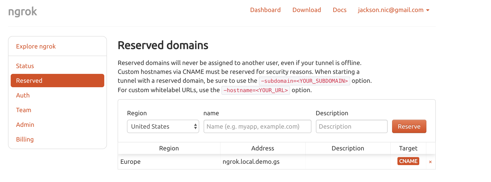
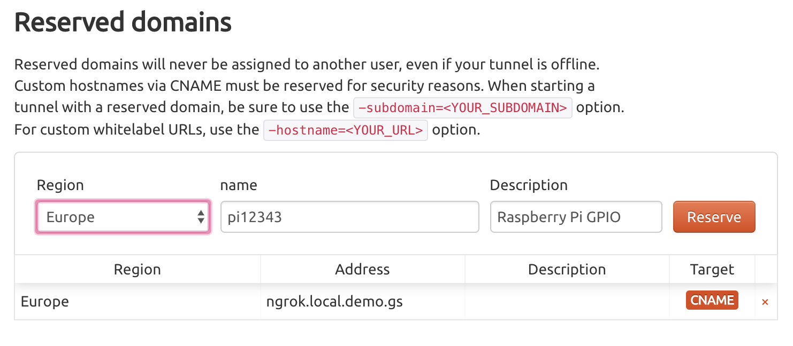
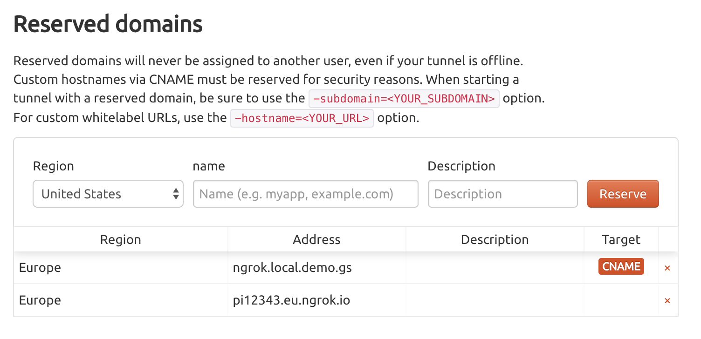
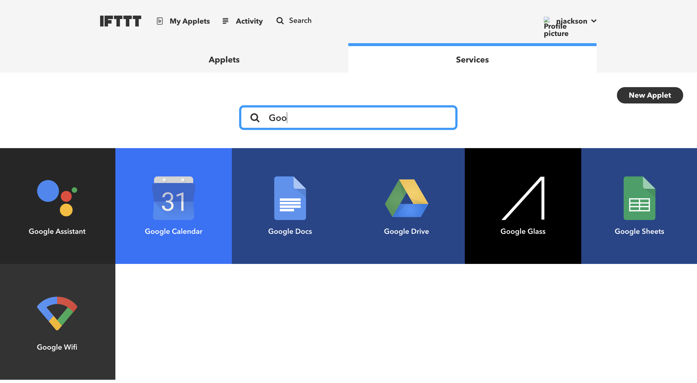
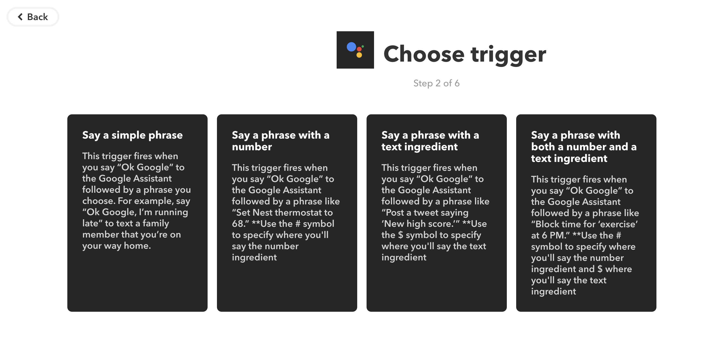
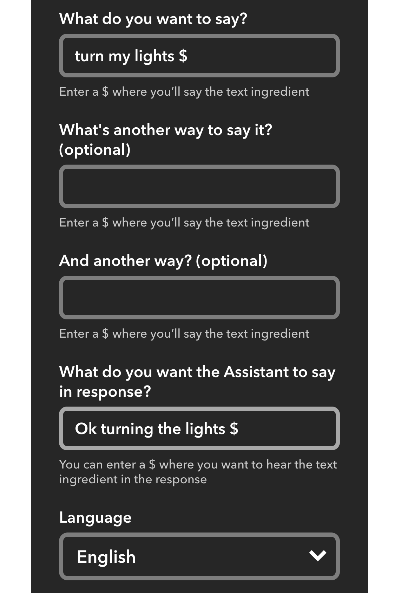
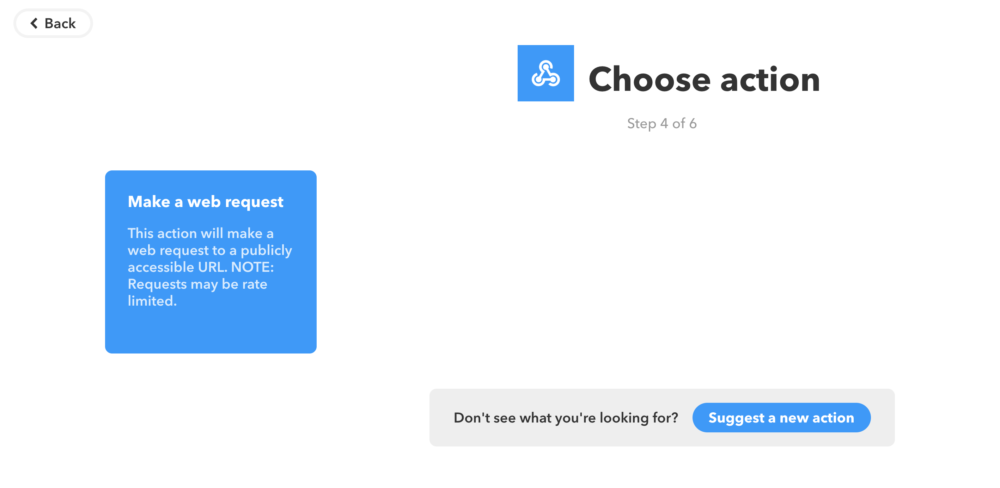
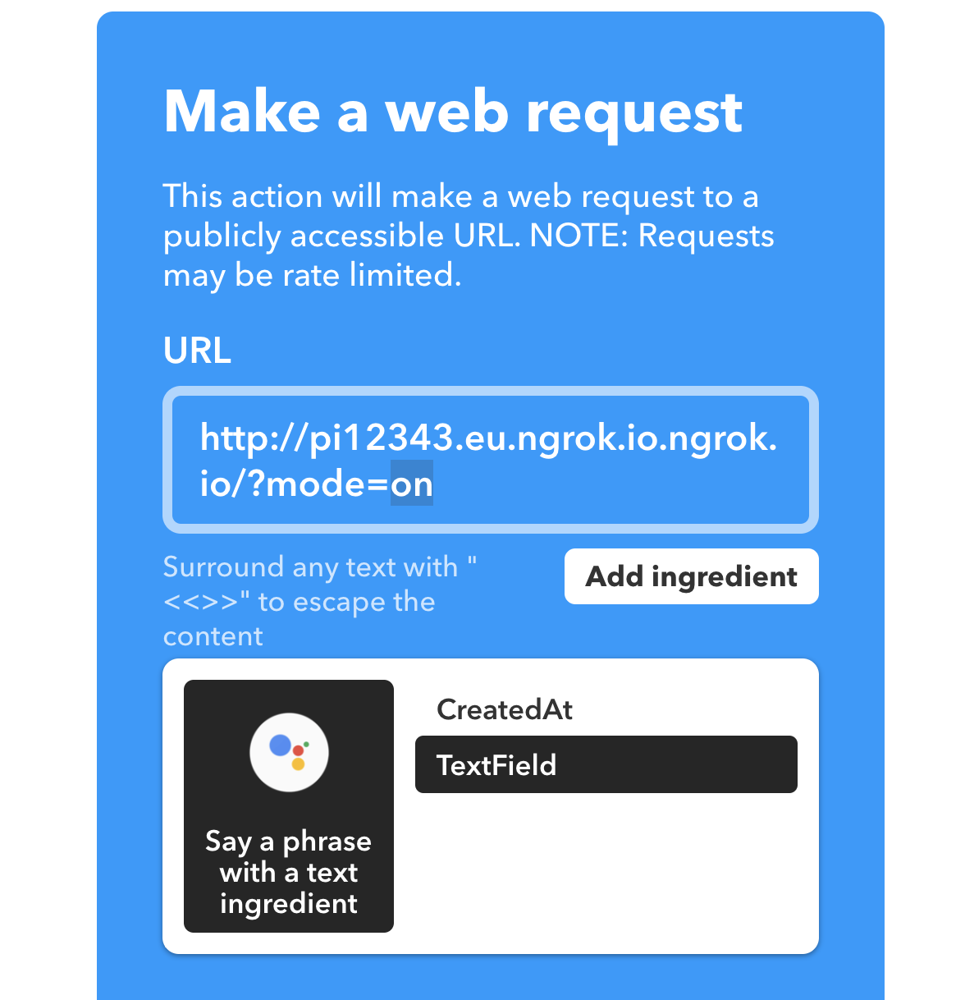
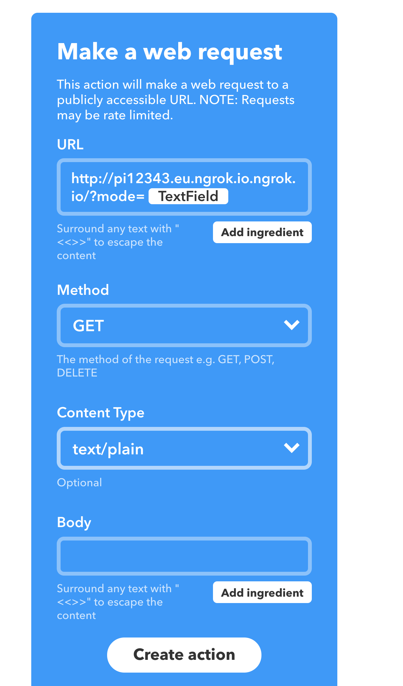
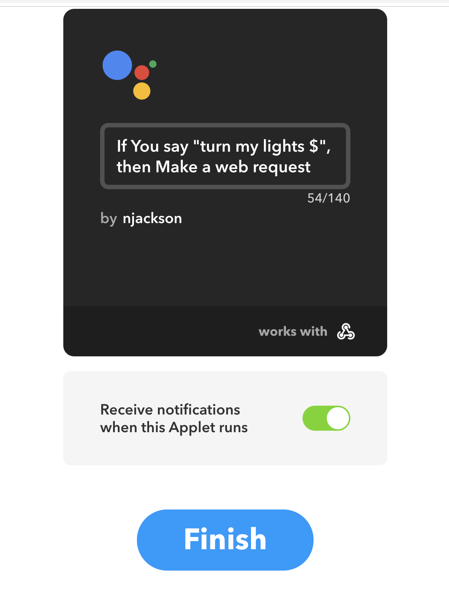

# Controlling LEDs via Google Assistant with the Raspberry Pi and Go
In this tutorial we will learn how we can activate and deactivate some LEDs connected to the Raspberry Pi with Google Assistant.

## Requirements
* Raspberry Pi
* 6x LEDs
* 6x 300ohm resistors
* Breadboard and jumper wires
* Google Assistant
* IFTTT account
* Ngrok Account
* [optional] soldering iron, solder and 26gauge wire

To create the application code we will be using Go which has full capability to compile for the Raspberry Pi.  The Raspberry Pi has a GPIO interface which we can use to connect LEDs to, by switching the state of the GPIO pin to High it sends current to that pin making the LED illuminate.

To interact with the GPIO interface for the Raspberry Pi we will use the [periph.io](https://periph.io), library which is a low level driver framework for many devices including the Raspberry Pi.

The file `main.go` in this repository is a completed version of the application to run on your Raspberry Pi.  To learn how to build this application check out the interactive tutorial on Instruqt.

[https://instruqt.com/public/tracks/golang-pi-project](https://instruqt.com/public/tracks/golang-pi-project)

## Connecting the LEDs to your Raspberry Pi
Connecting the LEDs to the GPIO outputs on the Pi is very straight forward, to protect the Raspberry Pi we need to use a `330ohm` resistor which is connected between the LED and the Pi.  For prototyping a bread board and jumper wires is a perfect way to connect everything in a non permanent way, you can of course solder things together to create a neater solution.


Our example application has 6 LEDs you will connect the `+` side of the LED, this is the side with the `long` leg to a separate GPIO pin, the `short` legs with the resistor attached can all be attached to the same `-` on the Pi.


Connect the `+` side of your LEDs to the following pins:

```
GPIO 14
GPIO 15
GPIO 18
GPIO 23
GPIO 24
GPIO 25
```


## Deploying the application to the Raspberry Pi
To deploy the application to the Raspberry Pi we can use the command `scp` which will allow us to copy the binary from our local machine over a SSH connection.

```bash
# scp [application] [username]@[pi]:~/
scp ./gpio-pi-arm pi@pi05.local:~
```

You can now ssh into the Raspberry Pi to continue the setup, make sure you use the correct username and network address for your Raspberry Pi

```bash
ssh pi@pi05.local
```

Let's move our application to /usr/local/bin where it will be accessible in the execution path

```bash
mv ./gpio-pi-arm /usr/local/bin
```

## Running the application as a background process
In order to for the application to start automatically we can run it with Systemd which is a process runner for Linux.

Create a file `gpio-pi.service` in `/etc/systemd/system` with the following contents:

```bash
  [Unit]
  Description = "GPIO Pi"
  
  [Service]
  KillSignal=INT
  ExecStart=/usr/local/bin/gpio-pi-arm
  Restart=always
```

We can now enable this in Systemd

```
sudo systemctl gpio-pi.service
sudo systemctl add-wants multi-user.target gpio-pi.service
sudo systemctl start gpio-pi.service
```

You can check that everything is running with the command `systemctl status gpio-pi`

```bash
$ systemctl status gpio-pi
● gpio-pi.service - "GPIO Pi"
   Loaded: loaded (/etc/systemd/system/gpio-pi.service; enabled; vendor preset: enabled)
   Active: active (running) since Tue 2018-12-04 08:51:55 GMT; 9s ago
 Main PID: 774 (gpio-pi-arm)
   CGroup: /system.slice/gpio-pi.service
           └─774 /usr/local/bin/gpio-pi-arm

Dec 04 08:51:55 pi05 systemd[1]: Started "GPIO Pi".
Dec 04 08:51:55 pi05 gpio-pi-arm[774]: 08:51:55.704452 Hello World
```


## Install Ngrok
Our application exposes a web server to control the LEDs, in order to activate this using Google Assistant we need to be able to expose the local server to the internet.  Since our Raspberry Pi is connected to the local network and behind NAT we can use a service called Ngrok to create a local tunnel which is accessible to an external address.

If you have not already done so create an account and login to the Ngrok service: [https://ngrok.com/](https://ngrok.com/).

Normally when you create a tunnel with Ngrok it will give you a random URL, we can also use `Reserved Domains` which will allow us to use the same domain every time our application starts.  Click on the `Reserved` menu item to access the reserved domains.



Complete the details for the domain, the `Name` for the domain is allocated globally across all Ngrok customers, choose a random name for your service, select the `Region` and click the `Reserve` button.



The domain will be allocated for you and the details will be shown in the UI.



We can now install the Ngrok application to the Raspberry Pi and use this domain.

```
wget https://bin.equinox.io/c/4VmDzA7iaHb/ngrok-stable-linux-arm.zip
unzip ngrok-stable-linux-arm.zip 
rm ngrok-stable-linux-arm.zip 
mv ngrok /usr/local/bin
```

In order to use reserved domains we need to authenticate Ngrok, we can do this with the following command, be sure to use the correct auth token, this can be found at [https://dashboard.ngrok.com/auth](https://dashboard.ngrok.com/auth):

```bash
./ngrok authtoken XXXXXXXXXXXXXXXXXX
```

To start Ngrok use the following command, replace the `-subdomain` with the value for reserved domain you created in the previous step.

```
ngrok http -subdomain=pi12343.eu.ngrok.io 9000
```

Your Raspberry Pi application will now be accessible from the following location, remember to use your reserved domain as the first part of the URI:

```
http://pi12343.eu.ngrok.io.ngrok.io/?mode=on
```

## Running Ngrok in the background
Like our application we need to be able to run Ngrok in the background so that it survives restarts on your Raspberry Pi.  To do this we follow a similar process that we performed to setup Systemd for our application.

Create a file `ngrok.service` in `/etc/systemd/system` with the following contents:

```bash
  [Unit]
  Description = "Ngrok"
  
  [Service]
  KillSignal=INT
  ExecStart=/usr/local/bin/ngrok http -subdomain=pi12343.eu.ngrok.io --log=stdout 9000
  Restart=always
```

We can now enable this in Systemd

```
sudo systemctl ngrok.service
sudo systemctl add-wants multi-user.target ngrok.service
sudo systemctl start ngrok.service
```

You can check that everything is running with the command `systemctl status ngrok`

```bash
$ systemctl status gpio-pi
● gpio-pi.service - "GPIO Pi"
   Loaded: loaded (/etc/systemd/system/gpio-pi.service; enabled; vendor preset: enabled)
   Active: active (running) since Tue 2018-12-04 08:51:55 GMT; 9s ago
 Main PID: 774 (gpio-pi-arm)
   CGroup: /system.slice/gpio-pi.service
           └─774 /usr/local/bin/gpio-pi-arm

Dec 04 08:51:55 pi05 systemd[1]: Started "GPIO Pi".
Dec 04 08:51:55 pi05 gpio-pi-arm[774]: 08:51:55.704452 Hello World
```

## Integrating with Google Assistant
Controlling the application using a web browser is pretty cool, however, controlling it from Google Assistant is even cooler, to easilly set this up we can use a service called [IFTTT](https://ifttt.com/).

If you do not already have one create an account on IFTTT, use the same Google Account which your Google Assistant is registered to.

The first step is to enable Google Assistant service for IFTTT, click on the `Services` tab and select `Google Assistant`.  Then follow the steps to activate your the service.



We can now create an `Applet` to integrate with our application.


Click on `New Applet`, and then `this` and select the Google Assistant service.


Select the say a phrase with a text ingredient option.



And fill in the details as follows, we are going to use a text substitution, the `$` in the setup will be passed to the next part of the applet as a variable.



Click the "Create Trigger" button and then we can configure the web hook which will call our service.


Click the `that` option and when prompted select `Webhook` from the service, we are going to select the "Make a web request" option.



Complete the details as shown in the following images, remember to use your own Ngrok URI.





We are now consuming the variable which we set up in the first part of our applet.

Click "Create" and then finally "Finish".



That is all we need to do, open your Google Assistant and tell it to "turn my lights on".

## Summary
I hope this has been a fun project to build, this is just scratching the surface of what you can do with your Raspberry Pi and Go, why not take things to the next level and check out [GoCv](https://gocv.io/) to interact with a camera attached to the Pi, or check out the higher level [GoBot](https://gobot.io/) framework to interact and control Robots from Go.